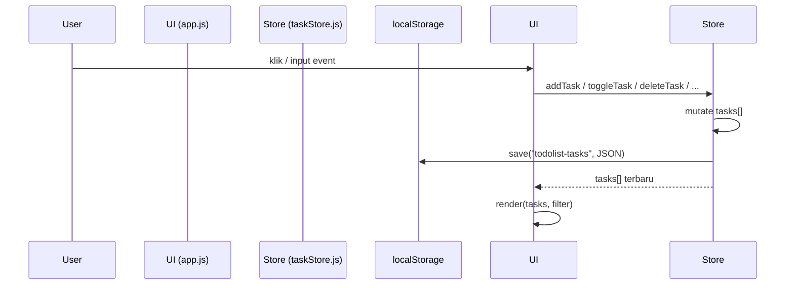

# Design Document: Todolist App

## Overview

Todolist App adalah aplikasi web frontend murni (HTML, CSS, JavaScript vanilla) yang memungkinkan pengguna mengelola daftar tugas harian. Aplikasi berjalan sepenuhnya di sisi klien — tidak ada server, tidak ada API eksternal. Data disimpan di `localStorage` browser sehingga persisten antar sesi.

Prinsip desain utama:
- **Single-page, zero dependencies** — satu file HTML, satu CSS, satu JS (atau bisa digabung).
- **Reactive UI** — setiap perubahan state di-render ulang secara minimal ke DOM.
- **Data layer terpisah** — logika bisnis (Task, filter, validasi) dipisah dari layer render DOM.

---

## Architecture

Aplikasi menggunakan arsitektur **MVC ringan** tanpa framework:

```
┌─────────────────────────────────────────────────┐
│                   index.html                    │
│  ┌────────────┐  ┌────────────┐  ┌───────────┐  │
│  │  app.js    │  │  style.css │  │ (markup)  │  │
│  │  (Controller + View)       │  │           │  │
│  └─────┬──────┘  └────────────┘  └───────────┘  │
│        │                                        │
│  ┌─────▼──────────────────────────────────┐     │
│  │          taskStore.js (Model)          │     │
│  │  - state: Task[]                       │     │
│  │  - CRUD operations                     │     │
│  │  - localStorage persistence            │     │
│  └─────────────────────────────────────────┘    │
└─────────────────────────────────────────────────┘
```

### Alur Data

1. **User interaction** → event handler di `app.js`
2. **app.js** memanggil fungsi di `taskStore.js` (mutasi state)
3. `taskStore.js` memperbarui array `tasks` dan menyimpan ke `localStorage`
4. `app.js` memanggil `render()` untuk memperbarui DOM sesuai state terbaru



---

## Components and Interfaces

### 1. `taskStore.js` — Model / Data Layer

Mengelola state tasks dan persistensi.

```js
/**
 * @typedef {Object} Task
 * @property {string}  id        - UUID unik
 * @property {string}  title     - Judul task (1–200 karakter)
 * @property {boolean} completed - Status penyelesaian
 * @property {number}  createdAt - Unix timestamp (Date.now())
 */

const STORAGE_KEY = "todolist-tasks";

// State internal
let tasks = []; // Task[]

// Public API
function loadTasks()              // -> Task[] | []
function saveTasks()              // -> void (throws StorageError)
function getAllTasks()             // -> Task[]
function addTask(title)           // -> Task (throws ValidationError)
function updateTaskTitle(id, title) // -> Task (throws ValidationError)
function toggleTask(id)           // -> Task
function toggleAllTasks()         // -> Task[]
function deleteTask(id)           // -> void
function deleteCompletedTasks()   // -> void
```

### 2. `app.js` — Controller + View Layer

Menangani event dan rendering DOM.

```js
// State UI
let currentFilter = "all"; // "all" | "active" | "completed"
let editingTaskId = null;   // id task yang sedang di-edit, atau null

// Fungsi utama
function render()                          // render ulang seluruh list
function renderTaskItem(task)              // buat elemen DOM untuk satu task
function renderFooter()                   // hitung & tampilkan "N tugas tersisa"
function renderMarkAllControl()           // update state checkbox mark-all
function setFilter(filter)                // ganti filter & render
function getFilteredTasks()               // -> Task[] sesuai filter aktif

// Event handlers
function handleAddTask(e)
function handleToggleTask(id)
function handleDeleteTask(id)
function handleDeleteCompleted()
function handleStartEdit(id)
function handleSaveEdit(id, newTitle)
function handleCancelEdit(id)
function handleToggleAll()
```

### 3. `index.html` — Markup Skeleton

```html
<div class="app-container">
  <h1>Todo List</h1>

  <!-- Input area -->
  <div class="input-area">
    <input id="task-input" maxlength="200" placeholder="Tambahkan tugas baru..." />
    <button id="add-btn">Tambah</button>
  </div>
  <p id="input-error" class="error-msg" aria-live="polite"></p>

  <!-- Mark all + List -->
  <div class="list-section">
    <div class="mark-all-area">
      <input type="checkbox" id="mark-all-checkbox" />
      <label for="mark-all-checkbox">Tandai Semua Selesai</label>
    </div>
    <ul id="task-list"></ul>
    <p id="empty-msg" class="empty-msg"></p>
  </div>

  <!-- Footer -->
  <footer class="list-footer">
    <span id="active-count">0 tugas tersisa</span>
    <div class="filter-buttons">
      <button class="filter-btn active" data-filter="all">Semua</button>
      <button class="filter-btn" data-filter="active">Aktif</button>
      <button class="filter-btn" data-filter="completed">Selesai</button>
    </div>
    <button id="clear-completed-btn" disabled>Hapus Semua yang Selesai</button>
  </footer>
</div>
```

---

## Data Models

### Task Object

```js
{
  id:        "uuid-v4-string",   // string, unik, immutable
  title:     "Beli susu",        // string, 1–200 karakter (trimmed)
  completed: false,              // boolean
  createdAt: 1718000000000       // number (ms epoch)
}
```

### localStorage Schema

```
key   : "todolist-tasks"
value : JSON.stringify(Task[])
```

Contoh nilai yang valid:
```json
[
  { "id": "abc-123", "title": "Beli susu", "completed": false, "createdAt": 1718000000000 },
  { "id": "def-456", "title": "Olahraga",  "completed": true,  "createdAt": 1717990000000 }
]
```

### Filter State

```js
type Filter = "all" | "active" | "completed"
```

---

## Correctness Properties

*A property is a characteristic or behavior that should hold true across all valid executions of a system — essentially, a formal statement about what the system should do. Properties serve as the bridge between human-readable specifications and machine-verifiable correctness guarantees.*

### Property 1: Task baru ditambahkan ke awal list

*For any* Task_List dengan N tasks dan judul valid (non-kosong, non-whitespace, ≤200 karakter), setelah `addTask(title)` dipanggil, panjang Task_List SHALL menjadi N+1 dan task dengan judul tersebut SHALL berada di indeks 0.

**Validates: Requirements 1.1, 1.2, 1.5**

---

### Property 2: Input whitespace/kosong selalu ditolak

*For any* string yang seluruhnya terdiri dari karakter whitespace (termasuk string kosong `""`), memanggil `addTask(string)` SHALL tidak mengubah panjang Task_List dan SHALL menghasilkan ValidationError.

**Validates: Requirements 1.4, 5.5**

---

### Property 3: Toggle status adalah operasi idempoten bolak-balik (round-trip)

*For any* task dalam Task_List, memanggil `toggleTask(id)` dua kali berturut-turut SHALL mengembalikan task ke status `completed` semula.

**Validates: Requirements 3.1, 3.3**

---

### Property 4: Jumlah active count selalu konsisten dengan state tasks

*For any* Task_List, nilai "N tugas tersisa" yang ditampilkan SHALL selalu sama dengan `tasks.filter(t => !t.completed).length`.

**Validates: Requirements 2.4, 2.5**

---

### Property 5: Filter mengembalikan subset yang benar

*For any* Task_List dan filter yang dipilih (`"all"`, `"active"`, `"completed"`), hasil `getFilteredTasks()` SHALL berisi tepat semua task yang memenuhi kondisi filter dan tidak ada yang lain.

**Validates: Requirements 6.3, 6.4, 6.5**

---

### Property 6: Persistensi round-trip mempertahankan data

*For any* Task_List yang valid, menyimpan ke `localStorage` lalu memuat ulang SHALL menghasilkan Task_List yang identik secara struktural (sama `id`, `title`, `completed`, `createdAt` untuk setiap task).

**Validates: Requirements 7.1, 7.2**

---

### Property 7: toggleAllTasks adalah operasi idempoten terhadap status all-completed

*For any* Task_List di mana semua task sudah `completed`, memanggil `toggleAllTasks()` SHALL mengubah semua task menjadi `completed = false`; memanggilnya lagi SHALL mengubah semua kembali menjadi `completed = true`.

**Validates: Requirements 8.2, 8.4**

---

### Property 8: deleteCompletedTasks tidak menghapus active tasks

*For any* Task_List, setelah `deleteCompletedTasks()` dipanggil, seluruh task dengan `completed = false` yang ada sebelumnya SHALL tetap ada dalam Task_List dengan data yang tidak berubah.

**Validates: Requirements 4.3**

---

### Property 9: Edit dengan judul valid memperbarui task yang tepat

*For any* task dalam Task_List dan judul valid (non-whitespace, ≤200 karakter), setelah `updateTaskTitle(id, newTitle)`, hanya task dengan `id` tersebut yang judul-nya berubah; semua task lain SHALL tidak termodifikasi.

**Validates: Requirements 5.2, 5.3**

---

## Error Handling

| Kondisi Error | Perilaku |
|---|---|
| Input kosong / hanya spasi saat tambah task | Tampilkan pesan `"Judul tugas tidak boleh kosong"` di bawah input; task tidak ditambahkan |
| Input kosong / hanya spasi saat edit task | Tampilkan pesan `"Judul tugas tidak boleh kosong"`; tetap di mode edit |
| Judul > 200 karakter | Browser/input mencegah pengetikan karakter ke-201 via `maxlength="200"` |
| `localStorage` penuh saat save | Tangkap `DOMException` di `saveTasks()`; tampilkan notifikasi error kepada pengguna; pertahankan state di memori |
| Data `localStorage` corrupt (parse gagal / field hilang) | Muat Task_List kosong; hapus key `"todolist-tasks"` dari storage |
| Task ID tidak ditemukan saat operasi | Operasi diabaikan; tidak ada error yang melempar ke UI |

### Hierarki Error

```
ValidationError  — input tidak valid (judul kosong, judul terlalu panjang)
StorageError     — gagal baca/tulis localStorage
```

---

## Testing Strategy

Fitur ini adalah aplikasi frontend vanilla dengan logika bisnis murni di `taskStore.js` dan layer render di `app.js`. Property-based testing (PBT) cocok diterapkan pada fungsi-fungsi `taskStore.js` karena mereka adalah **pure/near-pure functions** dengan perilaku yang bervariasi terhadap input.

### Library PBT

Gunakan **[fast-check](https://fast-check.dev/)** (JavaScript) sebagai library PBT.

```
npm install --save-dev fast-check
```

Konfigurasi minimum: **100 iterasi per property test** (default fast-check sudah ≥100).

### Unit Tests (Vitest atau Jest)

Fokus pada kasus konkret dan edge case:

| Test Case | Requirement |
|---|---|
| Menambah task dengan judul valid → task muncul di indeks 0 | 1.2, 1.5 |
| Menambah task dengan judul `""` → error, list tidak berubah | 1.4 |
| Menambah task dengan judul `"   "` → error, list tidak berubah | 1.4 |
| Toggle task: active → completed → active | 3.1, 3.3 |
| Hapus task → task hilang dari list | 4.2 |
| Hapus semua completed → hanya active tersisa | 4.3 |
| Tidak ada completed → tombol hapus selesai disabled | 4.4 |
| Edit judul valid → judul terupdate, task lain tidak berubah | 5.2 |
| Edit judul kosong → ValidationError, judul tidak berubah | 5.5 |
| Tekan Escape saat edit → judul kembali ke semula | 5.4 |
| localStorage corrupt → muat list kosong | 7.3 |
| localStorage penuh → tampilkan error, state tetap di memori | 7.4 |
| Mark all saat ada active → semua jadi completed | 8.2 |
| Mark all saat semua completed → semua jadi active | 8.4 |

### Property-Based Tests

Setiap property test menggunakan **fast-check** dengan tag komentar:

```
// Feature: todolist-app, Property N: <teks property>
```

| Property | Generators yang Digunakan |
|---|---|
| P1: Task baru di awal list | `fc.array(taskArb)`, `fc.string({minLength:1, maxLength:200})` |
| P2: Whitespace selalu ditolak | `fc.stringOf(fc.constantFrom(' ','\t','\n'))` |
| P3: Toggle round-trip | `fc.array(taskArb, {minLength:1})`, `fc.nat()` (pilih index) |
| P4: Active count konsisten | `fc.array(taskArb)` |
| P5: Filter subset benar | `fc.array(taskArb)`, `fc.constantFrom("all","active","completed")` |
| P6: Persistensi round-trip | `fc.array(taskArb)` + mock localStorage |
| P7: ToggleAll idempoten | `fc.array(taskArb, {minLength:1})` |
| P8: DeleteCompleted tidak hapus active | `fc.array(taskArb)` |
| P9: Edit hanya ubah target task | `fc.array(taskArb, {minLength:1})`, `fc.string({minLength:1, maxLength:200})` |

### Integration / UI Tests

- Gunakan **Playwright** atau pengujian manual untuk alur end-to-end.
- Cakup skenario: tambah → filter → edit → hapus → refresh halaman (cek persistensi).

### Catatan PBT

- `localStorage` di-mock saat property tests (gunakan objek `Map` sebagai pengganti).
- Setiap task dalam generator memiliki field `id` (UUID), `title` (string valid), `completed` (boolean), `createdAt` (integer positif).
