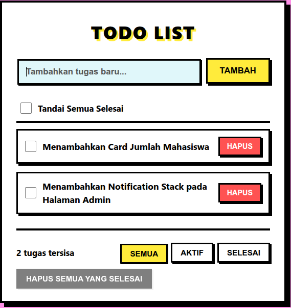

# To-Do List App (Neobrutalism Design)
<p align="center">
  
</p>
Aplikasi manajemen tugas (To-Do List) modern berbasis web yang dibangun sepenuhnya menggunakan Vanilla JavaScript, HTML5, dan CSS3 tanpa bergantung pada *framework* eksternal untuk merender komponen *client-side*. Aplikasi ini mengedepankan desain visual yang berani dengan gaya **Neobrutalism** dan interaksi *user experience* (UX) yang menarik.

## ✨ Fitur Utama

- **Neobrutalism UI**: Desain antarmuka mencolok dengan garis batas (*border*) hitam tebal, bayangan pekat (*hard shadow*), dan kombinasi warna kontras yang merespons secara mekanis saat diklik.
- **Drag and Drop (Susun Ulang Tugas)**: Mendukung pengurutan tugas secara manual menggunakan fitur *HTML5 Drag and Drop API*.
- **3D Stacked Notifications**: Sistem peringatan validasi input (*error*) yang muncul secara elegan menyerupai tumpukan kartu berlapis ke belakang (Stack View) seperti di antarmuka iOS modern.
- **Persistensi Data**: Terintegrasi otomatis dengan `localStorage` bawaan browser agar seluruh daftar tugas (termasuk hasil penyusunan ulang) aman dan tak hilang meskipun Anda memuat ulang (*refresh*) halaman.
- **Penyaringan Fleksibel**: Kemampuan menyaring (*filter*) daftar berdasarkan status: "Semua", "Aktif", atau "Selesai".
- **Aksi Kelompok (Bulk Actions)**: Menyediakan kendali cepat seperti "Tandai Semua Selesai" dan "Hapus Semua yang Selesai" untuk efisiensi produktivitas.

## 🚀 Cara Menjalankan Aplikasi

Aplikasi ini *client-ready* dan dapat langsung dijalankan tanpa konfigurasi *build-step* atau *server* lokal yang rumit.

1. *Clone* atau unduh repositori ini ke dalam sistem Anda.
2. Buka folder proyek hasil unduhan.
3. Klik ganda pada berkas `index.html` untuk langsung membukanya di aplikasi peramban (*browser*) favorit Anda (Chrome, Firefox, Safari, Edge).
4. *(Opsional)* Jika Anda menggunakan editor seperti Visual Studio Code, Anda dapat memanfaatkan ekstensi seperti **Live Server** untuk membuka aplikasi ini dan melihat pembaruan *live reload*.

## 🧪 Pengujian (Testing)

Aplikasi ini hadir dengan jaminan stabilitas berupa skema pengujian yang ketat. Logika inti (`taskStore.js`) dilindungi oleh kombinasi **Unit Tests** dan **Property-Based Tests** (menggunakan [*fast-check*](https://fast-check.dev/)).

### Menjalankan Tes

Pastikan Anda memiliki [Node.js](https://nodejs.org/) yang terinstal di mesin Anda.

1. Buka terminal di dalam direktori proyek ini.
2. Instal dependensi pengembangan (Vitest & fast-check):
   ```bash
   npm install
   ```
3. Jalankan pengujian:
   ```bash
   npm test
   ```
4. Terminal akan menunjukkan eksekusi dari 50+ skenario tes, termasuk pencegahan karakter kosong (*whitespace*), pembatasan 3-50 karakter judul tugas, stabilitas fungsi *Drag-and-Drop*, hingga garansi sinkronisasi penyimpanan *localStorage*.

## 🛠️ Struktur & Arsitektur Kode

Kode ini didesain menggunakan pola arsitektur **MVC (Model-View-Controller)** yang sangat ringan:

- **`taskStore.js` (Model)**: Berisi seluruh inti logika bisnis. Menyimpan *state array*, mengeksekusi fungsi CRUD (*Create, Read, Update, Delete*), mengatur batas validasi, dan membaca/menyimpan ke `localStorage`. Seluruh fungsinya terisolasi dan *pure*, membuatnya 100% *testable*.
- **`app.js` (Controller & View)**: Murni bertanggung jawab atas sinkronisasi Model dan DOM browser. Berisi fungsi-fungsi pendengar pergerakan (*Event Listeners*), pembentuk DOM untuk daftar HTML, operasi perhitungan animasi untuk UI berlapis (Stacked Notifications), dan logika tangkapan *drag event*.
- **`style.css` (Stylesheet)**: Sistem variabel dan properti CSS yang memberikan estetika gaya Neobrutalism serta efek transisi perpindahan susunan notifikasi bertumpuk 3D.
- **Kumpulan Dokumen (`.kiro/specs/`)**: Proyek ini memiliki spesifikasi yang terdefinisi ketat dalam wujud *requirements, product, dan design specification documents*.
